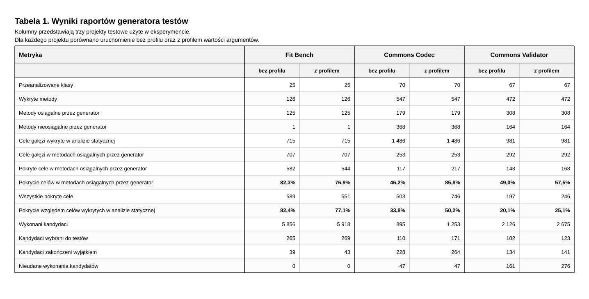
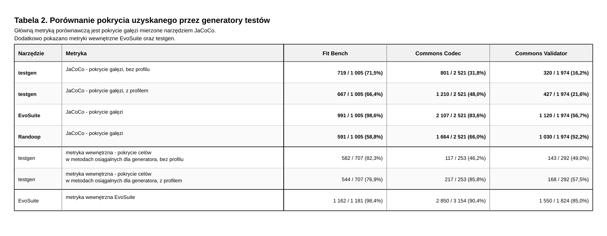

# Dokumentacja projektu testgen

Ten dokument wyjaśnia cel projektu, jak jest zorganizowany architektonicznie, oraz jak przebiega generowanie testów krok po kroku.

## 2. Cel projektu

Cel projektu to automatyczne generowanie testów regresyjnych dla aplikacji Java.

## 3. Idea działania w skrócie

Program działa w dwóch trybach:

### 3.1. Generowanie testów

To jest główny tryb działania programu. Przepływ wygląda następująco:

```text
- analiza projektu Maven,
- analiza źródeł Java przez JavaParser,
- wykrywanie klas, metod, konstruktorów i parametrów,
- wykrywanie gałęzi sterowania oraz celów pokrycia,
- przygotowanie przestrzeni wartości dla argumentów,
- generowanie kandydatów testów,
- uruchamianie kandydatów na instrumentowanym kodzie,
- wybór kandydatów, którzy zwiększają pokrycie,
- zapis testów JUnit 5 i raportu.
```


Pierwszym krokiem jest analiza projektu Maven. Program sprawdza, czy wskazany
katalog ma standardową strukturę projektu: plik pom.xml oraz katalog src/main/java.

Po rozpoznaniu projektu Maven następuje analiza statyczna kodu źródłowego.
Program czyta pliki .java bez uruchamiania  projektu. JavaParser
zamienia kod źródłowy na AST, czyli abstract syntax tree. Jest to struktura danych reprezentująca elementy języka Java. Dzięki temu można odnaleźć klasy, konstruktory, metody, parametry, typy zwracane, instrukcje if, pętle oraz instrukcje switch.

Na podstawie AST generator buduje opis struktury projektu. Powstają modele
klas, konstruktorów, metod i parametrów, które później są używane przy
tworzeniu kandydatów testów. Program tworzy też indeks typów  w analizowanym projekcie.
Dzięki temu może sprawdzić, czy nazwa typu argumentu odnosi się do klasy,
enuma albo interfejsu z tego projektu.

Na etapie analizy statycznej wykrywane są także cele pokrycia gałęzi.
Na przykład instrukcja if daje
co najmniej dwa cele: wejście w gałąź true i wejście w gałąź false. Podobnie
pętle i instrukcje switch są zamieniane na cele, które później można porównać
z rzeczywistym wykonaniem kandydata.

Generator próbuje też zebrać podpowiedzi wartości argumentów. Jeżeli w kodzie
znajduje się warunek typu amount > 100, to program może zapisać wartości
bliskie tej granicy, np. 100, 101 albo 99. Jeżeli warunek porównuje napis z
konkretną stałą, np. status.equals("PAID"), to taka wartość również może
trafić do puli argumentów.

Kolejny etap to generowanie kandydatów testów. Kandydat nie jest jeszcze
finalnym testem, tylko opisem jednego wywołania metody razem z obiektami
potrzebnymi do jej uruchomienia. Przykładowo kandydat może oznaczać:

- utwórz obiekt Customer,
- utwórz obiekt Order,
- utwórz obiekt DiscountService,
- wywołaj discountService.calculate(order).

Żeby taki kandydat mógł powstać, generator musi umieć przygotować obiekt
docelowy oraz argumenty metody. Dla prostych typów może użyć wartości
domyślnych, wartości z analizy statycznej albo wartości z profilu runtime. Dla
obiektów złożonych próbuje rekurencyjnie wywołać publiczny konstruktor, i
przygotować jego argumenty w ten sam sposób.

Następnie kandydaci są wykonywani na instrumentowanej kopii projektu.
Instrumentowana kopia to kopia kodu źródłowego, w której do wykrytych gałęzi
dopisano wywołania BranchRecorder.hit(). Dzięki temu podczas wykonania
kandydata program może zapisać, które cele pokrycia zostały rzeczywiście
osiągnięte.

Po wykonaniu kandydata generator zna dwa rodzaje informacji. Po pierwsze wie,
czy wywołanie zakończyło się normalnie, wyjątkiem, błędem wykonania albo
timeoutem. Po drugie wie, które gałęzie zostały pokryte. Do końcowego zestawu
testów wybierani są  ci kandydaci, którzy pokryli wcześniej niepokryte cele.

Na końcu program zapisuje testy JUnit 5 oraz raport tekstowy.  Raport pokazuje między
innymi liczbę przeanalizowanych klas i metod, liczbę metod osiągalnych dla
generatora, liczbę wykonanych kandydatów, i przede wszystkim uzyskane pokrycie gałęzi.
  
### 3.2. Przygotowanie profilu runtime

Drugi tryb generuje testów, tylko tworzy inną
instrumentowaną kopię projektu, którą można później uruchomić tak jak normalną  aplikację, albo uruchomić na niej istniejące testy.

Przepływ wygląda podobnie:

- analiza projektu Maven,
- analiza źródeł Java przez JavaParser,
- instrumentacja metod i konstruktorów do zapisu wartości argumentów,
- kompilacja instrumentowanej kopii projektu,
- uruchomienie instrumentowanej kopii przez użytkownika albo zewnętrzne narzędzie,
- zapis zaobserwowanych wartości argumentów na bieżąco w trakcie działania programu, do pliku observed-profile.txt.

Plik observed-profile.txt może potem zostać podany jako trzeci argument w
trybie generowania testów.

## 4. Dane wejściowe i wyjściowe

Wejście to katalog projektu Maven. Projekt powinien mieć  układ:

```text
pom.xml
src/main/java
```

Opcjonalnym wejściem jest plik `observed-profile.txt`, czyli wynik drugiego trybu pracy.

Wynikiem działania generatora są:

- `instrumented-src` - skopiowane i zmodyfikowane źródła badanego projektu,
- `classes` - skompilowane klasy instrumentowanej kopii,
- `generated-tests` - wygenerowane testy JUnit 5,
- `report.txt` - raport z analizy, generowania kandydatów i pokrycia.

Wyniki są zapisywane w katalogu `work-root`.

## 5. Uruchomienie

Pierwszy tryb generuje testy:

```text
testgen <maven-project-root> [work-root] [observed-profile]
```

Drugi tryb przygotowuje projekt do zebrania profilu runtime:

```text
testgen prepare-profile <maven-project-root> [work-root]
```

Tryb `prepare-profile` nie generuje testów. Tworzy instrumentowaną kopię projektu, która zapisuje wartości argumentów metod i konstruktorów podczas realnego uruchomienia programu. Taki plik można potem podać jako trzeci argument do właściwego generowania testów.

## 6. Architektura

Projekt jest zorganizowany w Clean Architecture  oraz Ports and Adapters (w części). 

Główne warstwy:

```text
domain
usecase
usecase/ports
infrastructure
cli
```

#### CLI

- `cli/Main.java` - punkt wejścia programu, uruchamia tryb
  generowania testów albo przygotowania profilu runtime.

#### Domain - analysis

- `domain/analysis/BranchId.java` - identyfikator pojedynczej gałęzi w kodzie.
- `domain/analysis/BranchKind.java` -`IF`,
  `FOR`, `WHILE`, `SWITCH`.
- `domain/analysis/BranchType.java` - strona gałęzi, np. `TRUE`, `FALSE`,
  `CASE`.
- `domain/analysis/ClassAnalysisResult.java` - wynik analizy jednej klasy.
- `domain/analysis/CoverageGoal.java` - pojedynczy cel pokrycia gałęzi.

#### Domain - generation

- `domain/generation/ArgumentValueHint.java` - podpowiedź wartości argumentu z
  analizy statycznej albo profilu runtime.
- `domain/generation/CandidateSpace.java` - bazowy kandydat i pule wartości
  możliwych do mutacji.
- `domain/generation/GeneratedArgument.java` - argument konstruktora albo metody.
- `domain/generation/GeneratedSetupObject.java` - obiekt tworzony przed
  wywołaniem metody którą testujemy.
- `domain/generation/GenerationRequirement.java` - wymaganie potrzebne do
  obsługi danej metody lub argumentu.
- `domain/generation/MethodGenerationPlan.java` - plan generowania testów dla
  konkretnej metody.
- `domain/generation/TestCandidate.java` - kandydat testu, czyli jedno
  konkretne wywołanie metody, razem z jej setupem.

#### Domain - structure

- `domain/structure/ClassStructure.java` - opis klasy, jej konstruktorów i
  metod.
- `domain/structure/ConstructorModel.java` - opis konstruktora.
- `domain/structure/ExecutableSignature.java` - buduje  sygnatury
  metod i konstruktorów.
- `domain/structure/MethodModel.java` - opis metody.
- `domain/structure/ParameterModel.java` - opis parametru.
- `domain/structure/ProjectClassStructureIndex.java` - indeks struktur klas używany przy budowaniu obiektów.
- `domain/structure/ProjectTypeIndex.java` - indeks typów z projektu: klas,
  enumów i interfejsów.
- `domain/structure/TypeInfo.java` - informacja o pojedynczym typie.
- `domain/structure/TypeKind.java` - rodzaj typu: klasa, enum albo interfejs.

#### Domain - execution i profile

- `domain/execution/ExecutionOutcome.java` - status wykonania kandydata, np `FAILED_TO_EXECUTE`, `RETURNED`
- `domain/execution/TestCandidateExecutionResult.java` - pełny wynik wykonania
  kandydata.
- `domain/profile/ObservedInvocation.java` - zapis pojedynczego
  zaobserwowanego wywołania - nieużywane aktualnie
- `domain/profile/ObservedProfile.java` - dane wczytane z pliku profilu
  runtime.

#### Usecase

- `usecase/MethodGenerationPlanner.java` - sprawdza, które metody mieszczą się
  w  ograniczeniach generatora.
- `usecase/InitialTestCandidateFactory.java` - tworzy bazowego kandydata testu
  dla metody.
- `usecase/SimpleSetupObjectGenerator.java` - buduje obiekty potrzebne do
  wywołania metody.
- `usecase/CandidateSpaceFactory.java` - tworzy przestrzeń wartości dla
  argumentów kandydata.
- `usecase/CandidateVariantGenerator.java` - generuje warianty kandydata przez
  zmianę wartości argumentów.
- `usecase/EvaluateProjectCandidatesUseCase.java` - wykonuje kandydatów i
  wybiera te, które zwiększają pokrycie.
- `usecase/CandidateCoverageEvaluator.java` - porównuje pokrycie kandydata z
  dotychczasowym pokryciem.
- `usecase/CandidateArchive.java` - przechowuje wybrane kandydaty.
- `usecase/JUnitCandidateTestWriter.java` - zamienia wybranych kandydatów na
  kod testów JUnit.
- `usecase/GenerationReport.java` - tworzy raport tekstowy z działania
  generatora.
- `usecase/SeedValueGenerator.java` - dostarcza wartości bazowe dla prostych
  typów.
- `usecase/SeededArgumentSetGenerator.java` - tworzy zestawy argumentów na
  podstawie seedów.
- `usecase/SetupObjectResolution.java` - opisuje wynik próby zbudowania
  obiektu setupu.

#### Ports

- `usecase/ports/CodeAnalyzer.java` - port analizy kodu i wykrywania celów
  pokrycia.
- `usecase/ports/ClassStructureAnalyzer.java` - port analizy struktury klas.
- `usecase/ports/TypeIndexAnalyzer.java` - port budowania indeksu typów.
- `usecase/ports/SourceInstrumenter.java` - port instrumentacji źródeł.
- `usecase/ports/TestCandidateExecutor.java` - port wykonania kandydata testu.
- `usecase/ports/ObservedProfileReader.java` - port odczytu profilu runtime.

#### Infrastructure - parser

- `infrastructure/parser/JavaParserTypeIndexAnalyzer.java` - buduje indeks
  typów z plików `.java`.
- `infrastructure/parser/JavaParserClassStructureAnalyzer.java` - odczytuje
  klasy, konstruktory, metody i parametry.
- `infrastructure/parser/JavaParserCodeAnalyzer.java` - wykrywa cele pokrycia
  i statyczne hinty argumentów.
- `infrastructure/parser/JavaParserLanguageLevel.java` - konfiguruje poziom
  języka dla JavaParsera.

#### Infrastructure - instrumentation

- `infrastructure/instrumentation/JavaParserBranchInstrumenter.java` -
  dopisuje `BranchRecorder.hit()` do gałęzi kodu.
- `infrastructure/instrumentation/JavaParserArgumentInstrumenter.java` -
  dopisuje zapis wartości argumentów metod i konstruktorów.
- `infrastructure/instrumentation/SourceDirectoryInstrumenter.java` -
  instrumentuje cały katalog źródeł.

#### Infrastructure - execution

- `infrastructure/execution/JavaSourceCompiler.java` - kompiluje
  instrumentowane źródła.
- `infrastructure/execution/ReflectionTestCandidateExecutor.java` - wykonuje
  kandydatów przez refleksję.
- `infrastructure/execution/GeneratedArgumentValueResolver.java` - zamienia
  zapisany argument na realną wartość Javy.
- `infrastructure/execution/RecordedBranchCoverageResolver.java` - odczytuje
  cele pokryte przez `BranchRecorder`.

#### Infrastructure - project, runtime i writer

- `infrastructure/project/MavenProjectLayoutDetector.java` - rozpoznaje układ
  projektu Maven.
- `infrastructure/project/MavenProjectLayout.java` - przechowuje ścieżki
  projektu Maven.
- `infrastructure/project/MavenDependencyClasspathResolver.java` - buduje
  classpath zależności Maven.
- `infrastructure/project/MavenProjectClasspath.java` - model classpath
  projektu.
- `infrastructure/project/InstrumentedProjectWorkspacePreparer.java` -
  przygotowuje instrumentowaną kopię projektu.
- `infrastructure/project/InstrumentedProjectWorkspace.java` - opis
  przygotowanego katalogu roboczego.
- `infrastructure/runtime/BranchRecorder.java` - zapisuje trafione cele
  pokrycia podczas wykonania kandydata.
- `infrastructure/runtime/ArgumentRecorder.java` - zapisuje wartości
  argumentów do profilu runtime.
- `infrastructure/runtime/TextObservedProfileReader.java` - czyta tekstowy
  profil runtime.
- `infrastructure/writer/GeneratedCandidateTestFileWriter.java` - zapisuje
  wygenerowane testy do plików.

## 7. Główne pojęcia projektu

### 7.1. Coverage goal

`CoverageGoal` oznacza cel pokrycia. Dla prostego warunku:

```java
if (amount > 100) {
    return 20;
}
return 0;
```

generator tworzy dwa cele:

```text
gałąź TRUE  - warunek spełniony
gałąź FALSE - warunek niespełniony
```

Każdy cel ma `BranchId`, który zawiera między innymi:

- nazwę klasy,
- sygnaturę metody,
- numer linii,
- typ konstrukcji, np. `IF`,
- typ gałęzi, np. `TRUE` albo `FALSE`.

Dzięki temu analiza statyczna i instrumentacja mogą mówić o tych samych gałęziach.

### 7.2. Argument value hint

`ArgumentValueHint` to podpowiedź wartości argumentu. Może pochodzić z analizy statycznej albo z profilu runtime.

Przykład:

```java
if (status.equals("PAID")) {
    return true;
}
```

Z takiego kodu można wyciągnąć hint:

```text
dla argumentu status warto spróbować "PAID"
```

Hint nie gwarantuje pokrycia. Jest tylko sugestią, którą generator wykorzystuje przy budowaniu puli wartości.

### 7.3. Test candidate

`TestCandidate` to kandydat testu, czyli opis tego, co trzeba wykonać.

Kandydat zawiera:

- klasę testowaną,
- metodę testowaną,
- typ zwracany,
- typy parametrów metody,
- obiekty setupu,
- nazwę zmiennej obiektu docelowego,
- argumenty metody.

Przykładowo kandydat może odpowiadać takiemu kodowi:

### 7.4. Candidate space

To bazowy kandydat plus informacja, które argumenty można zmieniać i jakie wartości można tam podstawiać.

W projekcie występuje pojęcie slotu. Slot oznacza konkretne miejsce na wartość:

```text
argument metody
argument konstruktora obiektu setupu
```

Przykład slotu:

```text
sample.DiscountService.calculate(int,String).amount
```

To oznacza parametr `amount` w konkretnej  metodzie. Sygnatura jest ważna, bo sama nazwa metody nie wystarcza przy przeciążonych metodach.

Wartości w puli mają tier:

- `EXACT` - wartość dokładnie dla tego slotu, np. z runtime albo z warunku w tej metodzie,
- `RELATED` - miejsce przygotowane na wartości powiązane (nieosługiwane na ten moment, za trudne)
- `FALLBACK` - wartości domyślne,brane jeśli hinty z profilu lub analizy statycznej nic nie zwróciły
- `NULL` 


## 8. Szczegółowy przepływ 

zgodnie z kolejnością z `Main.generateTests`.

### 8.1. Wybór trybu i odczyt argumentów

Program startuje w `Main.main`.

Jeśli pierwszy argument to:

```text
prepare-profile
```

program uruchamia tryb przygotowania profilu runtime. W przeciwnym razie uruchamiany jest tryb generowania testów.

Dla generowania testów program przygotowuje trzy ścieżki:

- `projectRoot` - katalog analizowanego projektu Maven,
- `workRoot` - katalog roboczy na wyniki,
- `observedProfilePath` - opcjonalny plik z runtime profile.

### 8.2. Rozpoznanie projektu Maven

Pierwszy  krok to:

```java
MavenProjectLayout projectLayout = layoutDetector.detect(projectRoot);
```

`MavenProjectLayoutDetector` sprawdza, czy podana ścieżka jest katalogiem projektu Maven. Weryfikuje przede wszystkim:

- czy istnieje katalog projektu,
- czy istnieje `pom.xml`,
- czy istnieje `src/main/java`,
- czy istnieje opcjonalny `src/main/resources`.

Wynikiem jest `MavenProjectLayout`. Ten obiekt przechowuje ścieżki potrzebne w dalszych krokach, więc reszta programu nie musi zgadywać, gdzie znajdują się źródła albo plik `pom.xml`.

### 8.3. Znalezienie plików Java

Następnie program przechodzi po katalogu `src/main/java` i zbiera pliki `.java`.

Na tym etapie nie analizujemy jeszcze znaczenia kodu.

### 8.4. Budowa indeksu typów

`JavaParserTypeIndexAnalyzer` buduje `ProjectTypeIndex`.

ProjectTypeIndex odpowiada na pytanie, czy plik `java` jest enumem, interfejsem czy klasą,


Ten indeks jest później potrzebny przy planowaniu metod i generowaniu argumentów. Jeśli parametr jest enumem, generator może wybrać jedną ze stałych. Jeśli parametr jest interfejsem, projekt nie będzie potrafił go zbudować i go zignoruje.

### 8.5. Odrzucenie plików, które nie są klasami

Po zbudowaniu indeksu program wybiera tylko źródła klas. Enumy i interfejsy są ważne tylko jako typy argumentów dla metod i konstruktorów w tych klasach.

### 8.6. Analiza kodu metod

`JavaParserCodeAnalyzer` analizuje kod wewnątrz metod.

Wykrywa cele pokrycia dla:

- `if`,
- `for`,
- `while`,
- zwykłego `switch`, bez `switch expression`

Dla `if` tworzone są zwykle dwa cele: `TRUE` i `FALSE`. Dla `switch` tworzony jest cel dla każdego `case` i dla `default`, jeśli występuje.

Analyzer wyciąga też statyczne hinty wartości argumentów. Przykłady:

```java
if (amount > 100)
```

może dać wartości bliskie `100` i `101`.

```java
if (status.equals("PAID"))
```

może dać wartość `"PAID"` dla argumentu `status`.

To nie jest symbolic execution. Program nie próbuje rozwiązać dowolnego warunku - ten problem jest ekstremalnie trudny, NASA próbowała go rozwiązać poprzez Symbolic PathFinder. 
Nasz program zbiera tylko proste, bezpośrednie podpowiedzi, które można wykorzystać jako wartości testowe.

### 8.7. Analiza struktury klas

`JavaParserClassStructureAnalyzer` analizuje klasy z innej perspektywy niż `JavaParserCodeAnalyzer`.

Nie interesuje go jakie warunki są w środku metody, tylko po prostu odczytuje:

- nazwę klasy,
- publiczne i niepubliczne metody,
- konstruktory,
- parametry konstruktorów,
- parametry metod,
- i ich typy

Wynikiem jest lista `ClassStructure`.

### 8.8. Indeks struktur klas

`ProjectClassStructureIndex` pozwala szybko znaleźć strukturę klasy po nazwie.

Jest potrzebny głównie przy budowaniu obiektów. Jeśli metoda ma parametr:

```java
calculate(Order order)
```

generator musi sprawdzić, czy `Order` jest klasą z projektu i czy da się stworzyć jej instancję przez konstruktor. Bez indeksu trzeba byłoby za każdym razem ręcznie przeszukiwać listę wszystkich klas.

### 8.9. Planowanie metod

`MethodGenerationPlanner` tworzy `MethodGenerationPlan` dla publicznych metod.

Planner sprawdza  wymagania, na przykład:

- czy metoda jest publiczna,
- czy klasa ma publiczny konstruktor bezargumentowy, a jeśli nie będzie wymagała obiektu setupu,
- czy argument jest typem prostym,
- czy argument jest `String`,
- czy argument jest enumem,
- czy argument wygląda na kolekcję, mapę, interfejs albo obiekt.

Planner nie gwarantuje jeszcze, że uda się zbudować pełnego kandydata. Pełna próba następuje dopiero w `CandidateSpaceFactory` i `InitialTestCandidateFactory`.

### 8.10. Wczytanie profilu runtime

Jeśli użytkownik podał trzeci argument, program używa `TextObservedProfileReader`.

Plik `observed-profile.txt` zawiera rekordy tekstowe typu:

```text
hint|ownerId|argumentName|argumentType|value|source
invocation|ownerId|type1|value1|type2|value2
```

Rekord `hint` oznacza pojedynczą zaobserwowaną wartość argumentu. Rekord `invocation` oznacza zestaw argumentów zaobserwowany razem w jednym wywołaniu - wywołania są rejestrowane, ale na ten moment nie są później używane.

Aktualnie najważniejszą rolą profilu runtime jest dostarczenie wartości argumentów z rzeczywistego użycia.

### 8.11. Przygotowanie mapy coverage goals

Po analizie kodu program ma wyniki typu `ClassAnalysisResult`. Każdy wynik zawiera między innymi listę `CoverageGoal`.

Przed instrumentacją tworzona jest mapa:

```text
Path -> List<CoverageGoal>
```

Instrumentator potrzebuje tej mapy, żeby wiedzieć, jakie `BranchRecorder.hit(...)` trzeba wstawić do konkretnego pliku.

### 8.12. classpath projektu

`MavenProjectClasspath` przygotowuje classpath potrzebny do kompilacji i uruchamiania instrumentowanej kopii projektu.

Łączy dwa źródła:

- classpath aktualnie uruchomionego `testgen`,
- zależności badanego projektu Maven.

Zależności badanego projektu są pobierane przez `MavenDependencyClasspathResolver`, który uruchamia:

```text
mvn dependency:build-classpath
```

pyta Mavena, jakie zewnętrzne biblioteki są potrzebne do kompilacji kodu badanego projektu.

Classpath `testgen` jest potrzebny między innymi dlatego, że instrumentowany kod wywołuje klasy runtime takie jak `BranchRecorder` albo `ArgumentRecorder`.

### 8.13. Instrumentowana kopia projektu

`InstrumentedProjectWorkspacePreparer` tworzy katalog  z instrumentowanym kodem.

W trybie generowania testów używany jest:

```text
JavaParserBranchInstrumenter
```

Ten instrumentator dodaje do gałęzi wywołania:

```java
BranchRecorder.hit("...");
```

Przykład:

```java
if (amount > 100) {
    BranchRecorder.hit("...TRUE");
    return 20;
} else {
    BranchRecorder.hit("...FALSE");
}
```
Modyfikowana jest kopia w `work-root/instrumented-src`.

Po instrumentacji kod jest kompilowany do `work-root/classes`.

### 8.14. Zebranie wszystkich hintów argumentów

Program łączy hinty z dwóch źródeł:

- statyczne hinty z `JavaParserCodeAnalyzer`,
- runtime hinty z `observed-profile.txt`.

Wspólna lista trafia potem do `CandidateSpaceFactory`.

Dzięki temu generator może spróbować zarówno wartości wynikających z kodu, jak i wartości zaobserwowanych w realnym wykonaniu aplikacji.

### 8.15. Budowanie bazowego kandydata

`InitialTestCandidateFactory` próbuje zbudować minimalnego kandydata dla metody.

Najpierw próbuje wygenerować argumenty metody. Jeśli argumenty to nie typy proste, to próbuje zbudować obiekt przez `SimpleSetupObjectGenerator`.

Następnie musi zbudować obiekt docelowy, czyli instancję klasy, na której zostanie wywołana metoda.

Jeśli czegoś nie da się zbudować, bazowy kandydat nie powstaje. 

### 8.16. Budowanie obiektów setupu

`SimpleSetupObjectGenerator` próbuje stworzyć obiekt wymagany jako argument albo jako target metody.

Działa rekurencyjnie:

1. Sprawdza, czy typ parametru jest klasą znaną w `ProjectClassStructureIndex`.
2. Szuka publicznego konstruktora.
3. Dla każdego parametru konstruktora próbuje wygenerować prostą wartość.
4. Jeśli parametr konstruktora też jest obiektem projektowym, próbuje zbudować go w ten sam sposób.
5. Ma limit głębokości i wykrywanie cykli zhardkodowany na 5

Przykład:

```java
Order(int amount, Customer customer)
Customer(String status)
```

Generator może przygotować:

```java
Customer customer = new Customer("");
Order order = new Order(0, customer);
```

Nie oznacza to, że wybrane wartości pokryją interesujące branche. Oznacza tylko, że metoda jest technicznie osiągalna i można ją wywołać.

### 8.17. Budowanie candidate space

`CandidateSpaceFactory` bierze bazowego kandydata i buduje pule wartości dla argumentów.

Pule powstają dla:

- argumentów metody,
- argumentów konstruktorów obiektów setupu.

Każdy slot ma identyfikator oparty o sygnaturę metody albo konstruktora oraz nazwę argumentu. To jest ważne przy przeciążonych metodach. Dzięki temu `decode(String)` i `decode(Int)` nie dzielą tej samej puli wartości.

Do puli trafiają:

- wartości z hintów pasujących dokładnie do slotu,
- wartość bazowego kandydata,
- `null` dla typów referencyjnych,
- seed values,
- stałe enumów.

### 8.18. Generowanie wariantów kandydatów

`CandidateVariantGenerator` tworzy warianty z `CandidateSpace`.

Aktualnie strategia jest prosta:

- zachowuje bazowego kandydata,
- tworzy kilku kandydatów startowych z losowymi wartościami z najlepszych dostępnych tierów,
- tworzy mutacje jednego slotu,
- tworzy mutacje dwóch slotów,
- pilnuje limitu liczby kandydatów.

Jest to prosta mutacja kandydatów, którą można rozszerzyć.

### 8.19. Wykonanie kandydatów

`CandidateCoverageEvaluator` przekazuje kandydatów do executora.

Implementacją executora jest:

```text
ReflectionTestCandidateExecutor
```

Executor:

1. czyści `BranchRecorder`,
2. ładuje klasy z `work-root/classes`,
3. tworzy obiekty setupu,
4. rozwiązuje argumenty z  wartości zapisanych w kandydacie,
5. wybiera metodę po nazwie i typach parametrów,
6. wywołuje metodę przez refleksję,
7. zapisuje wynik: zwrot wartości, wyjątek albo błąd wykonania,
8. odczytuje pokryte branche z `BranchRecorder`.

Rozróżnienie wyników:

- `RETURNED` - metoda zakończyła się normalnie,
- `THREW_EXCEPTION` - metoda  rzuciła wyjątek,
- `FAILED_TO_EXECUTE` - generatorowi nie udało się poprawnie wykonać kandydata
- `TIMED_OUT` -  limit czas.

### 8.20. Selekcja kandydatów

`CandidateArchive` trzyma zbiór branchy, które zostały już pokryte przez wybranych kandydatów.

Jeśli nowy kandydat nie pokrywa nic nowego, jest pomijany. Jeśli pokrywa przynajmniej jeden nowy branch, trafia do arhciwum.

Writer testów zapisuje tylko wyniki, które można sensownie zamienić na test:

- normalny zwrot wartości,
- wyjątek rzucony przez metodę docelową.

Jeżeli  kandydat zakończył się wyjątkiem, test może zostać zapisany jako:

```java
assertThrows(ExceptionType.class, () -> target.method());
```

### 8.21. Zapis testów JUnit

`GeneratedCandidateTestFileWriter` zapisuje pliki testów. W środku używa `JUnitCandidateTestWriter`, który tworzy kod testu jako tekst.

Generowany test odtwarza:

- obiekty setupu,
- wywołanie metody,
- prostą asercję regresyjną.

Dla wartości prostych powstaje `assertEquals`. Dla obiektów może powstać `assertNotNull`. Dla wartości `null` może powstać `assertNull`. Dla wyjątków `assertThrows`.

### 8.22. Zapis raportu

`GenerationReport` tworzy raport tekstowy po polsku.

Raport pokazuje między innymi:

- liczbę przeanalizowanych klas,
- liczbę przeanalizowanych metod,
- liczbę metod, dla których faktycznie przygotowano kandydatów,
- liczbę wykrytych celów pokrycia,
- liczbę celów w metodach dla których jestesmy w stanie stworzyć kandydata,
- liczbę pokrytych celów w tych metodach
- wszystkie pokryte cele (jest zwykle większa od powyższej, bo kandydat mógł pokryć branch z metody której nie obsługujemy)
- liczbę wykonanych kandydatów,
- liczbę kandydatów zakończonych normalnie, wyjątkiem albo błędem wykonania.

W raporcie mogą wystąpić dwie różne liczby pokrycia:

```text
Pokryte cele w metodach, dla których przygotowano kandydatów
Wszystkie pokryte cele
```

Druga liczba może być większa, ponieważ wywołanie publicznej metody może wejść do prywatnych metod pomocniczych. Te prywatne metody też mogły mieć wykryte branche, nawet jeśli generator nie tworzy dla nich  kandydatów.

## 9. Przepływ trybu prepare-profile

Tryb `prepare-profile` służy do zebrania realistycznych wartości argumentów z działającej aplikacji.

Ten tryb:

1. rozpoznaje projekt Maven,
2. tworzy instrumentowaną kopię źródeł,
3. używa `JavaParserArgumentInstrumenter`,
4. kompiluje instrumentowaną kopię,


Różnica względem trybu generowania testów jest taka, że tutaj nie używa się `BranchRecorder`, tylko `ArgumentRecorder`.

Instrumentator dodaje na początku metod i konstruktorów wywołanie:

```java
ArgumentRecorder.record(...);
```

Recorder zapisuje tylko proste wartości:

- typy liczbowe,
- `boolean`,
- `String`,
- `char`,
- enumy,
- `null`.


`ArgumentRecorder` zapisze plik:

```text
observed-profile.txt
```

Ten plik jest potem wejściem dla normalnego generowania testów.

## 10. Przykład całościowy

Załóżmy, że w analizowanym projekcie jest klasa:

```java
public class DiscountService {
    public int calculate(String status, int amount) {
        if (status.equals("PAID")) {
            return amount > 100 ? 20 : 10;
        }

        return 0;
    }
}
```

Program przejdzie przez taki kod mniej więcej tak:

1. Layout detector potwierdzi, że projekt ma `pom.xml` i `src/main/java`.
2. Znajdziemy plik `DiscountService.java`.
3. Project Type index zapisze, że `DiscountService` jest klasą.
4. Code analyzer znajdzie branch dla `if (status.equals("PAID"))`.
5. Code analyzer zapisze hint `"PAID"` dla argumentu `status`.
6. Code analyzer zapisze hinty wokół wartości `100` dla argumentu `amount`.
7. Class structure analyzer zobaczy metodę `calculate(String, int)` oraz konstruktory klasy.
8. Method planner sprawdzi, że metoda ma obsługiwane parametry.
9. Instrumentator utworzy kopię klasy z wywołaniami `BranchRecorder.hit(...)`.
10. Initial candidate factory utworzy bazowego kandydata, np. z pustym stringiem i zerem.
11. Candidate space doda pule wartości dla `status` i `amount`.
12. Variant generator utworzy kandydatów z wartościami takimi jak `"PAID"`, `100`, `101`, `0`.
13. Executor uruchomi kandydatów na instrumentowanej klasie.
14. BranchRecorder pokaże, które gałęzie zostały trafione.
15. CandidateArchive zostawi kandydatów dodających nowe pokrycie.
16. Writer zapisze testy JUnit.
17. Report zapisze podsumowanie.

To jest podstawowy model całego projektu.

## 11. Raport


Przykładowe pola:

```text
Przeanalizowane metody
Metody, dla których przygotowano kandydatów
Metody, dla których nie udało się przygotować kandydatów
```

Pierwsza liczba mówi, ile metod znaleziono. Druga mówi, dla ilu rzeczywiście udało się zbudować candidate space, czyli bazowego kandydata i pule wartości.

Dla branchy warto patrzeć szczególnie na:

```text
Cele w metodach, dla których przygotowano kandydatów
Pokryte cele w metodach, dla których przygotowano kandydatów
```

To pokazuje pokrycie w zakresie metod, które generator rzeczywiście był w stanie testować bezpośrednio.

## 12. Ograniczenia 


- brak  obsługi kolekcji i map,
- brak mockowania interfejsów,
- brak obsługi Spring,
- brak pełnego odtwarzania sesji użytkownika (czyli np. sekwencja wywołań metod,a nie tylko konstruktorów)
- brak obsługi branchy w lambdach, streamach i operatorze trójargumentowym,

Potencjalne kierunki rozwoju:

- więcej generacji mutacji kandydatów,
- uruchamianie kandydatów między generacjami
- obsługa kolekcji i map 
- lepsze wykorzystanie `ObservedInvocation` - do sekwencji wywołań metod w celu znalezienia większego pokrycia
- propagacja hintów przez konstruktory, pola i gettery,

## 13. Porównanie z Randoop i EvoSuite

Randoop jest przykładem generowania losowego sterowanego informacją zwrotną z wykonania. W EvoSuite jtesty są optymalizowane przez algorytm ewolucyjny. `testgen` jest prostszym prototypem, który łączy analizę statyczną, runtime profile z wartościami argumentów i własny pomiar pokrycia gałęzi.

### 13.1. Randoop


Uproszczony algorytm Randoopa wygląda tak:

```text
1. Weź listę dostępnych konstruktorów, metod i pól 
2. Wybierz operację, która ma być ostatnim krokiem nowej sekwencji.
3. Dla parametrów tej operacji znajdź pasujące wartości utworzone przez wcześniejsze sekwencje.  Na początku pula zawiera proste wartości i krótkie sekwencje bazowe.
4. Sklej sekwencje tworzące argumenty z nową operacją końcową.
5. Uruchom powstałą sekwencję.
6. Sklasyfikuj wynik wykonania.
7. Jeśli sekwencja jest przydatna, dodaj ją do puli komponentów.
8. Na końcu zapisz testy regresyjne i testy ujawniające błędy.
```


Randoop klasyfikuje wygenerowane sekwencje, na kategorie:

- sekwencje regresyjne, 
- sekwencje ujawniające błąd, 
- sekwencje niepoprawne


Mocną stroną Randoopa jest że potrafi dochodzić do stanów programu, których nie da się osiągnąć jednym prostym wywołaniem metody. Jest więc dobry dla klas, gdzie zachowanie zależy od kolejnych operacji na obiekcie.

Minusem jest to, że Randoop nie zaczyna od analizy warunków w kodzie źródłowym i nie tworzy wartości dokładnie pod konkretny parametr w konkretnej metodzie. Jeśli gałąź wymaga wartości `"PAID"`, `100`, pustego stringa albo konkretnej stałej enuma, Randoop musi dojść do niej przez losowanie, przez wartości dostępne w puli albo przez wcześniej utworzone sekwencje.

### 13.2. EvoSuite


Uproszczony model danych EvoSuite:

```text
TestSuiteChromosome
    -> TestCase 1
        -> statement 1
        -> statement 2
        -> statement 3
    -> TestCase 2
        -> statement 1
        -> statement 2
```

Algorytm EvoSuite:

```text
1. Utwórz początkową populację losowych zestawów testów.
2. Uruchom każdy zestaw testów.
3. Zmierz, które cele pokrycia zostały osiągnięte.
4. Oblicz fitness każdego zestawu testów.
5. Wybierz lepsze osobniki jako rodziców.
6. Zastosuj krzyżowanie, czyli połącz fragmenty dwóch zestawów testów.
7. Zastosuj mutację, czyli zmień testy przez dodanie, usunięcie albo modyfikację instrukcji i wartości.
8. Powtarzaj proces do wyczerpania budżetu czasu albo osiągnięcia celu.
9. Zminimalizuj wynikowy zestaw testów.
10. Dodaj asercje regresyjne opisujące aktualne zachowanie programu.
```

Najważniejszą częścią jest funkcja fitness. Dla pokrycia gałęzi EvoSuite nie ocenia tylko tego, czy branch został już pokryty. Narzędzie może też oszacować, jak blisko test był pokrycia danej gałęzi, przy pomocy branch distance.

Dzięki temu algorytm ewolucyjny może stopniowo przesuwać wartości w stronę tych, które spełnią warunek.


Mutacje w Evosuite mogą obejmować:

- zmianę wartości prymitywnej albo stringa,
- dodanie nowej instrukcji do testu,
- usunięcie instrukcji,
- zmianę wywoływanej metody,
- zmianę argumentów metody,
- skrócenie albo wydłużenie sekwencji wywołań.

Krzyżowanie polega na wymianie fragmentów między kandydatami. 

### 13.3. Różnica względem testgen

W porównaniu z Randoop, `testgen` nie buduje długich sekwencji wywołań. Kandydat testu to zwykle jedno wywołanie metody docelowej
oraz setup potrzebny do utworzenia obiektu i argumentów. Dzięki temu przepływ
jest prostszy do prześledzenia, ale generator gorzej radzi sobie z branchami, które mogą zostać osiągnięte po wielu operacjach.

W porównaniu z EvoSuite, `testgen` nie implementuje pełnego podejścia search-
based testing. Nie optymalizuje całych zestawów testów jako populacji, nie
korzysta z branch distance, approach level, krzyżowania ani wielogeneracyjnej
ewolucji. Strategia jest prostsza: generator tworzy warianty
kandydatów, wykonuje je i wybiera te, które faktycznie zwiększają pokrycie.

Plusem `testgen` jest  połączenie analizy statycznej z
profilem runtime. Analiza statyczna dostarcza informacji o strukturze kodu,
celach pokrycia i wartościach występujących w warunkach, a profil runtime
dodaje rzeczywiste wartości argumentów zaobserwowane podczas działania
aplikacji. 

Skuteczność tego jednak  zależy od jakości dostarczonego profilu projektu, oraz
sposobu mieszania wartości statycznych i runtime.


`testgen` jest więc bardziej zawężony, ale można powiedzieć bardziej 'transparentny': można łatwo wskazać, skąd wzięła się dana wartość argumentu: z warunku w kodzie, z profilu runtime, z enuma, z wartości bazowej. Łatwo też wyjaśnić, dlaczego kandydat został zapisany jako test: ponieważ po wykonaniu na instrumentowanej kopii projektu pokrył nowy `BranchId`.


Źródła:

- Randoop manual: https://randoop.github.io/randoop/manual/index.html
- EvoSuite documentation: https://www.evosuite.org/documentation/
- EvoSuite repository overview: https://github.com/EvoSuite/evosuite

## 14. Eksperymenty

Wyykonano eksperymenty na trzech projektach testowych:

- `Fit Bench` - projekt przygotowany specjalnie jako benchmark dla generatora (wygenerowany automatycznie przez AI)
- `Commons Codec` - biblioteka Apache Commons służąca do kodowania i dekodowania danych,
- `Commons Validator` - biblioteka Apache Commons do walidacji danych

`Fit Bench` pozwala sprawdzić, jak generator działa w warunkach zgodnie z jego aktualnymi ograniczeniami. Projekty Apache Commons pokazują natomiast, jak narzędzie zachowuje się na kodzie, który nie był pisany pod ten generator.

Eksperymenty obejmowały dwa rodzaje porównań. Pierwsze porównanie dotyczyło samego `testgen`: uruchomienia bez profilu runtime oraz uruchomienia z profilem wartości argumentów. Drugie porównanie zestawiało wyniki `testgen` z narzędziami Randoop i EvoSuite. Główną metryką w tym drugim zestawieniu było pokrycie gałęzi mierzone przez JaCoCo.

### 14.1. Wyniki raportów testgen

Pierwszy wykres:



Wyniki pokazują, że wpływ profilu runtime nie jest jednakowy dla wszystkich projektów. Dla `Commons Codec` profil wyraźnie poprawił wynik. Jest to przypadek, w którym wartości zaobserwowane podczas wykonania testów EvoSuite dostarczyły użytecznych argumentów, a generator mógł wykorzystać je przy budowaniu kandydatów.

Dla `Commons Validator` poprawa była mniejsza. Jedną z przyczyn jest jakość profilu wejściowego. Profil był zebrany na podstawie testów wygenerowanych przez EvoSuite, a dla `Commons Validator` EvoSuite osiągnął słabsze wyniki niż dla `Commons Codec`, jak będzie widać na drugim wykresie. Oznacza to, że profil runtime zawierał mniej przydatnych wartości i słabiej reprezentował różne ścieżki wykonania biblioteki.

Dla `Fit Bench` wynik z profilem był niższy niż bez profilu. Powód -  W tym projekcie statyczny analizator hintów działał bardzo dobrze, ponieważ warunki w kodzie były w dużej mierze zależne od jawnych wartości argumentów, stałych liczbowych, napisów i enumów. 

Dodanie wartości z profilu mogło `zaciemnić` tę dobrą przestrzeń wartości: generator rozważał więcej danych realistycznych, ale gorszych z punktu widzenia konkretnych branchy. Tutaj głównym winowającą jest sposób wybierania argumentów dla początkowych kandydatów, który zakłada że hinty z analizy statycznej jak i profilera mają taką samą wagę.

### 14.2. Porównanie z EvoSuite i Randoop

Drugie zestawienie skupia się przede wszystkim na pokryciu gałęzi mierzonym przez JaCoCo. Dzięki temu `testgen`, Randoop i EvoSuite są porównywane jedną zewnętrzną metryką, niezależną od wewnętrznego sposobu liczenia celów przez konkretne narzędzie.



W tabeli pokazano osobno wynik `testgen` bez profilu i z profilem. Dla EvoSuite i Randoopa przedstawiono pokrycie gałęzi JaCoCo uzyskane przez wygenerowane testy. Dodatkowo pozostawiono metrykę wewnętrzną EvoSuite oraz metrykę wewnętrzną `testgen` dotyczącą celów w metodach osiągalnych dla generatora.

EvoSuite osiąga najwyższe wyniki w większości eksperymentów - wykorzystuje funkcję fitness, branch distance, mutacje, krzyżowanie i minimalizację całych zestawów testów. `testgen` ma znacznie prostszą strategię generowania kandydatów i nie implementuje jeszcze pełnej pętli ewolucyjnej.

Randoop osiąga wyniki pośrednie. 

Wyniki `testgen` są niższe, ale nie są całkowicie oderwane od
wyników uzyskanych przez istniejące narzędzia. Szczególnie w metryce
wewnętrznej, liczonej dla metod osiągalnych dla generatora, projekt pokazuje,
że obecny przepływ potrafi skutecznie pokrywać część kodu mieszczącą się w
jego ograniczeniach. Różnica względem EvoSuite wynika głównie z prostszej
strategii generowania i mutacji kandydatów.


Eksperymenty wskazują też kierunek dalszego rozwoju. Obecny generator potrzebuje lepszego sposobu wyboru wartości początkowych i mutacji, oraz dodania generacji, i refleksyjnego wykonywania testów między generacjami, w celu znalezienia najlepszych generacji.  Ważne jest kontrolowane mieszanie wartości z analizy statycznej i profilu runtime. Profil nie powinien wypierać wartości dobranych statycznie, jeśli te wartości dobrze odpowiadają warunkom w kodzie. Z drugiej strony, dla projektów takich jak `Commons Codec` wartości runtime mogą wyraźnie poprawić pokrycie.

