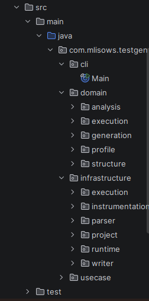
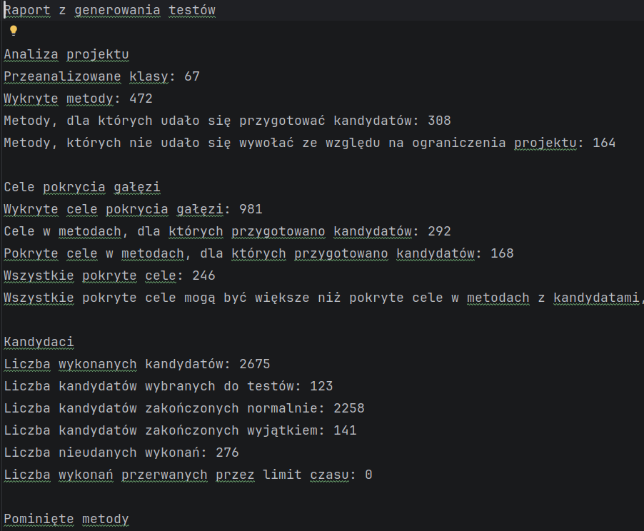

# testgen

`testgen` - to system automatycznego generowania  testow jednostkowych dla aplikacji Java.

Jest to generator, ktory laczy statyczna analize kodu, instrumentacje, wykonywanie kandydatow testow, i selekcje tych kandydatow na podstawie pokrytych galezi programu.

TLDR przepływu:

- program analizuje projekt Maven i sprawdza, czy ma standardowy układ z
  `pom.xml` oraz katalogiem `src/main/java`,
- potem w analizie statycznej, za pomocą javaparsera, znajduje pliki źródłowe `.java` i na ich podstawie rozpoznaje
  klasy, konstruktory, metody, parametry 
- nastepnie wykrywa cele pokrycia gałęzi, na przykład gałęzie
  instrukcji `if`, `for`, `while` i `switch`,
- z warunków w kodzie próbuje wyciągnąć podpowiedzi wartości argumentów, np. liczby graniczne, napisy albo wartości enumów,
- dla metod, które mieszczą się w aktualnych ograniczeniach projektu,
  przygotowuje kandydatów testów, czyli konkretne wywołania metod razem z
  potrzebnymi obiektami i argumentami,
- opcjonalnie wykorzystuje observed profile, czyli wartości argumentów
  zaobserwowane podczas wcześniejszego uruchomienia instrumentowanej aplikacji (tworzenie tej instrumentowanej kopii to oddzielny flow programu)
- tworzy instrumentowaną kopię badanego projektu, aby podczas uruchamiania
  kandydatów można było sprawdzić, które gałęzie kodu zostały faktycznie
  wykonane,
  - uruchamia kandydatów testów w trakcie działania programu i zapisuje wynik każdego wykonania
- wybiera do końcowego zestawu te kandydaty, które zwiększają pokrycie celów  gałęzi,
- na końcu zapisuje testy JUnit 5 oraz raport tekstowy opisujący analizę
  projektu, liczbę kandydatów i uzyskane pokrycie.


## Uruchamianie

1. Poprzez docker compose

Najpierw zbuduj obraz:

```bash
docker compose build
```

wygeneruj testy dla przykladowego projektu:

```bash
docker compose run --rm generate-tests
```

Wyniki pojawia sie w:

```text
target/test-work/fit-bench/generated-tests
target/test-work/fit-bench/report.txt
```

- `generated-tests` - wygenerowane testy JUnit,
- `report.txt` - raport z analizy

## Uruchomienie z profilem runtime

Program potrafi korzystac z wartosci argumentow zaobserwowanych podczas rzeczywistego uruchomienia aplikacji. Repozytorium zawiera gotowy profil dla przykladowego projektu:

```text
examples/fit-bench/observed-profile.txt
```

Testy z profilem runtime mozna wygenerowac tym samym serwisem Docker Compose:

```bash
docker compose run --rm generate-tests-with-profile
```

Wyniki pojawia sie w:

```text
target/test-work/fit-bench-with-profile/generated-tests
target/test-work/fit-bench-with-profile/report.txt
```

Profil mozna tez przygotowac samodzielnie. Najpierw trzeba utworzyc instrumentowana kopie projektu:

```bash
docker compose run --rm prepare-profile
```

Ten krok zapisuje instrumentowane zrodla i skompilowane klasy w katalogu:

```text
target/docker-profile-work/fit-bench
```

Nastepnie trzeba uruchomic przykladowa aplikacje na tej instrumentowanej kopii:

```bash
docker compose run --rm record-profile
```

Po tym kroku powstaje plik:

```text
target/docker-profile-work/fit-bench/observed-profile.txt
```

## Uruchomienie lokalne

Wymagania:

- Java 21,
- Maven,
- projekt Maven, ktory ma standardowy katalog `src/main/java`.

Uruchomienie testow projektu `testgen`:

```bash
mvn test
```

Zbudowanie programu i skopiowanie zaleznosci:

```bash
mvn -q -DskipTests package dependency:copy-dependencies
```

Wygenerowanie testow dla przykladowego projektu:

```bash
java -cp "target/classes:target/dependency/*" \
  com.mlisows.testgen.cli.Main \
  examples/fit-bench \
  target/test-work/fit-bench-local
```

Ogolna postac polecenia:

```text
testgen <maven-project-root> [work-root] [observed-profile]
```

Tryb przygotowania profilu runtime:

```text
testgen prepare-profile <maven-project-root> [work-root]
```

## Przykladowy projekt

Przykladowy projekt testowy znajduje sie w:

```text
examples/fit-bench
```

Jest to zwykly projekt Maven z klasami domenowymi, enumami, konstruktorami, metodami i galeziami sterowania. Projekt zostal wygenerowany automatycznie,w taki sposob żeby miescił się w ograniczeniach aktualnego MVP generatora.


## Jak dziala generator

Glowne wejscie programu znajduje sie w klasie:

```text
src/main/java/com/mlisows/testgen/cli/Main.java
```

Przeplyw generowania testow jest nastepujacy:

1. Program rozpoznaje uklad projektu Maven. Sprawdza katalog projektu, `pom.xml`, `src/main/java` i opcjonalne zasoby.
2. Program znajduje pliki `.java` w katalogu z kodem produkcyjnym.
3. JavaParser buduje indeks typow. Dzieki temu generator wie, ktore pliki opisuja klasy, enumy albo interfejsy.
4. Generator analizuje kod metod i wykrywa cele pokrycia galezi. Aktualnie obslugiwane sa przede wszystkim `if`, `for`, `while` i `switch`.
5. Generator zbiera statyczne podpowiedzi wartosci argumentow. Przykladowo warunek `amount > 100` moze dac podpowiedz wartosci bliskich `100`.
6. Generator analizuje strukture klas. Odczytuje konstruktory, metody, parametry, typy argumentow i typy zwracane.
7. Planner metod sprawdza ograniczenia generatora. Odrzucane sa metody, ktorych aktualna wersja programu nie umie  obsluzyc, na przykład List<> jako parametr.
8. Program opcjonalnie wczytuje profil runtime z pliku tekstowego. Profil zawiera wartosci argumentow zaobserwowane podczas prawdziwego uruchomienia instrumentowanej aplikacji.
9. Program tworzy instrumentowana kopie projektu. Do kodu zrodlowego dodawane sa wywolania runtime recorderow - ta kopia jest kompilowana do osobnego katalogu.
0Generator tworzy przestrzenie kandydatow. Dla kazdej metody, którą jestesmy w stanie obsłużyć biorąc pod uwagę ograniczenia naszego projektu, probujemy zbudowac obiekt docelowy, potrzebne obiekty pomocnicze (jak konstruktory klas zależnych) i argumenty metody.
12. Generator tworzy warianty kandydatow. Korzysta z wartosci pobranych w analizie statycznej, wartosci pobrane z rzeczywistego działania programu, wartosci domyslnych, i prostych mutacji.
13. Kandydaci sa wykonywani przez refleksje na instrumentowanej kopii projektu -  `BranchRecorder` zapisuje, ktore cele pokrycia zostaly trafione podczas wykonania kandydata.
4Do koncowych testow wybierani sa kandydaci, ktorzy dodali nowe pokrycie. 
4Program zapisuje wygenerowane testy JUnit i raport.

## Architektura

Korzystamy w dużej mierze z Clean Architecture:

```text
src/main/java/com/mlisows/testgen/domain
src/main/java/com/mlisows/testgen/usecase
src/main/java/com/mlisows/testgen/usecase/ports
src/main/java/com/mlisows/testgen/infrastructure
src/main/java/com/mlisows/testgen/cli
```

Warstwy:

- `domain` - modele danych, na przyklad kandydat testu, cel pokrycia, plan metody, struktura klasy,
- `usecase` - logika generowania kandydatow, mutacji, oceny pokrycia i raportowania,
- `usecase/ports` - porty które implementujemy w warstwie infrastruktury,
- `infrastructure` - implementacje, np. analizy przez JavaParser, kompilacji plików, wykonywania kandydatów, czy runtime recorderów zbierających rzeczywiste wartości parametrów metod i konstruktorów które pojawiły się w trakcie działania zewnętrznego projektu,
- `cli` - punkt wejscia programu.
- 



## Co jest zaimplementowane

Zakres projektu:

- analiza projektow Maven,
- analiza klas, metod, konstruktorow i parametrow,
- analiza struktur klas i enumow,
- wykrywanie galezi `if`, `for`, `while` i `switch`,
- statyczne podpowiedzi wartosci argumentow,
- profil  z wartosciami argumentow które rzeczywiście wystąpiły w zewnętrznym projekcie
- instrumentacja kodu do mierzenia pokrycia galezi,
- instrumentacja kodu do zapisu wartosci argumentow runtime,
- generowanie kandydatow testow,
- rekurencyjne budowanie obiektow pomocniczych przez publiczne konstruktory,
- generowanie wariantow i prostych mutacji argumentow,
- wykonywanie kandydatow przez refleksje,
- selekcja kandydatow na podstawie nowego pokrycia,
- zapis testow JUnit 5,
- raport tekstowy


## Ograniczenia


- brak wsparcia dla kolekcji, map, list
- brak  mockowania zaleznosci,
- brak obsługi Spring i innych frameworkow,
- brak pelnego odtwarzania sesji uzytkownika(jest rekurencyjne budowanie obiektów, czyli metod i potrzebnych konstruktorów, ale nie ma odtwarzenia sekwencji metod które mogłyby pokryć nowy cel)
- brak obslugi galezi  w lambdach, streamach, operatorze trojargumentowym i skrotowych warunkach logicznych,


Raport generowania pokazuje te ograniczenia: ile metod przeszlo podstawowe reguly, dla ilu faktycznie udalo sie przygotowac kandydatow i ile celow pokrycia znajduje sie w metodach, ktore generator byl w stanie wywolac.


## Dokumenty pomocnicze

W repozytorium znajduje się dokładniejsza dokumentacja:

- [PROJECT_DOCUMENTATION.md](PROJECT_DOCUMENTATION.md) -

Wyniki eksperymentów i wykresy znajdują się w katalogu:

  ```text
  local/experiment-results
  ```